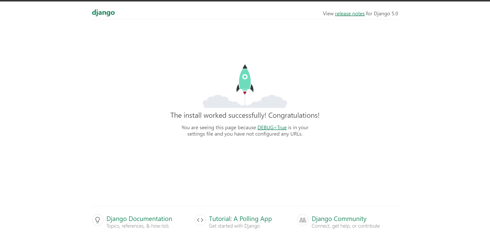
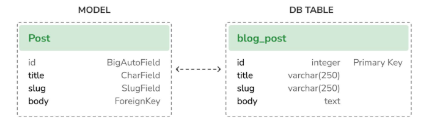

Step 1: First of Create Virtual Environment with Using of command (python  -m venv Building_a_Blog_Application)
Step 2: Install django by using  pip install django
Step 3: Create a new project in the terminal with the command : django-admin startproject mysite

The Django Architecture

asgi.py  is an ASGI (Asynchronous Server Gateway Interface) specification that defines how to write server applications. It's used for running asynchronous code

wsgi.py is an (Web Server Gateway Interface) script that tells your web server how to communicate with Django.

Step 4: Navigate to your project directory (cd mysite).
Step 5: Applying initial database migrations for app, use this command: python manage.py makemigrations and then python manage.py migrate
Step 6: Run the development server (python manage.py runserver)

In django we a default host and port http://127.0.0.1:8000, if i  want to user custom port then we will use (python manage.py runserver 127.0.0.1:8001 --settings=mysite.settings). <b>When you have to deal with multiple environments that require different configurations,
you can create a different settings file for each environment.<b>

Step 7: Create an app called "blog" and add  it to INSTALLED_APPS in setting.py 
To do this, you need to open the mysite folder inside the mysite folder and then edit the setting.py file.

Step  8: Creating the Post model in models.py file, we will define a Post model that will allow us to store blog posts in the database.

Step 9: By adding different datetime fields to the Post model.Each post will be published at a specific date and time.